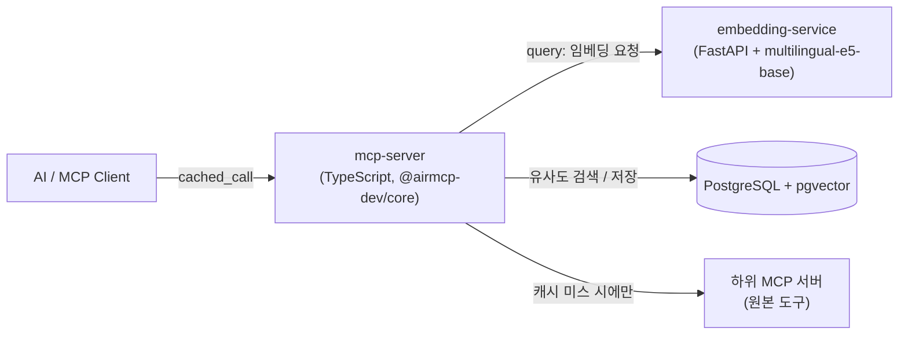
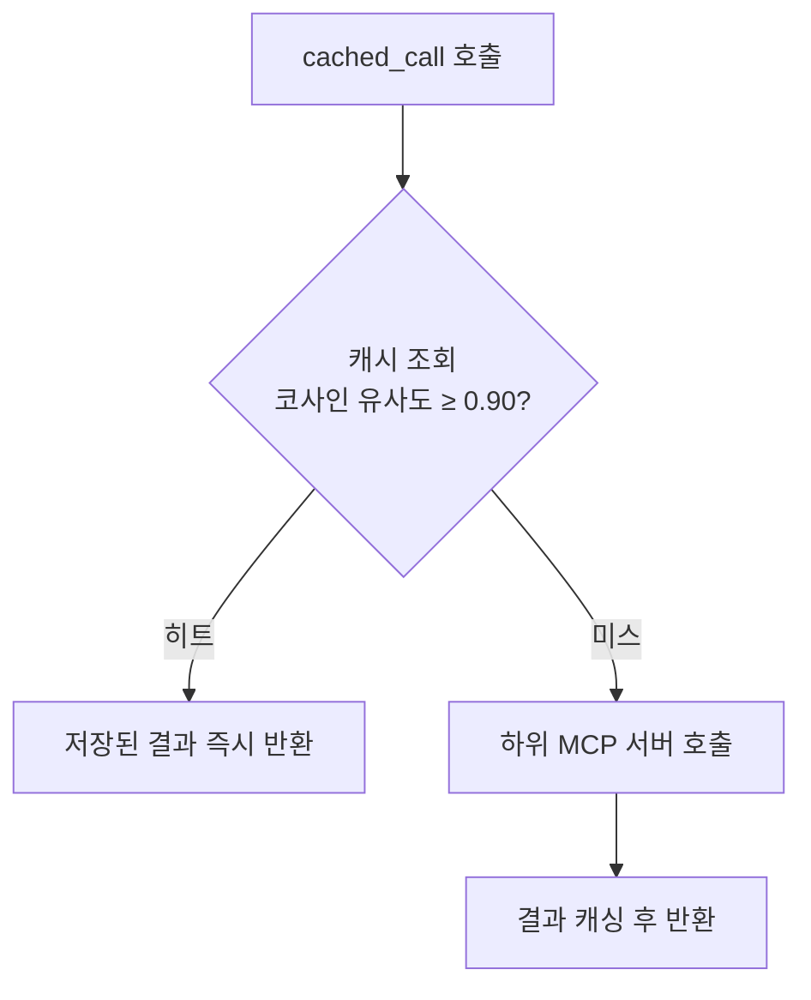

# Smart Cache MCP

AI가 MCP 도구를 호출할 때마다 소비하는 토큰을 줄이기 위한 **캐싱 프록시 MCP 서버**입니다.

다른 MCP 서버 앞단에 위치해, AI가 원본 도구를 직접 호출하는 대신 이 서버의 `cached_call` 도구 하나만 호출하면 됩니다. 캐시 조회 → (미스 시) 원본 호출 → 결과 저장이 내부에서 자동으로 처리되며, 정확히 같은 요청뿐 아니라 **의미적으로 유사한 요청도 임베딩 기반 퍼지 매칭으로 캐시 히트** 처리합니다.

> 포트폴리오 프로젝트입니다. 실제 토큰 절감 효과를 [`benchmark/`](benchmark)로 직접 측정해 [`benchmark/REPORT.md`](benchmark/REPORT.md)에 결과를 남겼습니다.

## 왜 필요한가

현재 MCP 생태계에는 반복/유사 호출로 인한 토큰 낭비를 막는 캐싱 계층이 없습니다. 같은 질문, 혹은 표현만 다른 질문을 AI가 반복해서 도구로 호출할 때마다 원본 서버를 다시 부르고 그 결과를 다시 컨텍스트에 채워 넣는 비용이 그대로 발생합니다. Smart Cache MCP는 이 낭비를 프록시 계층에서 흡수합니다.

```
기존:      AI → 원본 MCP 서버 → 결과            (매번 토큰 소비)
Smart Cache: AI → Smart Cache MCP → 캐시 히트 시 즉시 반환   (토큰 절감)
                        └─ 캐시 미스 시에만 원본 MCP 호출
```

## 핵심 특징

- **프록시 방식**: AI는 `cached_call` 하나만 호출하면 캐싱이 자동 처리됨
- **퍼지 매칭**: `multilingual-e5-base` 임베딩 + pgvector HNSW 코사인 유사도(임계값 0.90)로 의미적으로 유사한 요청도 캐시 히트로 처리 — 다국어 질의도 지원
- **중요도 기반 TTL**: AI가 응답의 중요도(1~5)를 판단해 캐시 수명을 5분~48시간까지 동적으로 설정
- **우선순위 기반 교체**: `importance × log₂(hit_count+2) × recency_weight` 공식으로 캐시 포화 시 중요도 낮은 항목부터 자동 제거
- **장애 대응 3종**: PostgreSQL Advisory Lock 기반 캐시 스탬피드 방지, 임베딩 서비스 장애 시 SHA-256 해시 정확 매칭 폴백, 원본 MCP 장애 시 stale-while-revalidate
- **SSRF 방어**: `register_mcp`가 프로덕션 환경에서 사설/루프백/링크로컬 대역(클라우드 메타데이터 엔드포인트 포함)으로의 등록을 차단 (로컬 개발 편의를 위해 `NODE_ENV=production`에서만 강제)
- **선택적 인증 + 전역 레이트리밋**: `MCP_AUTH_TOKEN` 설정 시 5개 도구 전부에 토큰 인증 강제 (미설정 시 로컬 개발 편의를 위해 인증 없음). 항상 켜져 있는 `shield` 설정으로 프롬프트/명령어 인젝션 패턴 탐지, 도구별 레이트리밋(파괴적 동작인 `cache_clear`는 5회/분으로 특히 타이트), 감사 로그 기록

## 아키텍처



3개 컨테이너가 Docker Compose로 함께 뜹니다: `mcp-server`(프록시 겸 MCP 서버), `embedding-service`(임베딩 전용), `postgres`(pgvector 확장, 벡터+메타데이터 저장).

`cached_call` 내부에서는 히트/미스가 다음과 같이 갈립니다:



다이어그램에는 없지만 실제로 함께 동작하는 예외 처리: 캐시 미스가 동시에 몰릴 때 PostgreSQL Advisory Lock으로 중복 원본 호출을 막고(스탬피드 방지), 임베딩 서비스가 죽으면 SHA-256 해시 정확 매칭으로 폴백하며, 원본 MCP가 죽으면 만료된 캐시라도 `stale: true`로 반환합니다 (stale-while-revalidate).

## 5개 MCP 도구

| 도구 | 설명 |
|---|---|
| `cached_call` | 하위 MCP 도구를 캐시를 통해 호출 (핵심 도구) |
| `register_mcp` | 하위 MCP 서버를 별칭으로 등록 |
| `cache_stats` | 히트율, 절감 토큰 추정치, 도구별/쿼리별 통계 조회 |
| `cache_clear` | 캐시 초기화 (전체 / 특정 MCP / 특정 도구) |
| `cache_config` | 유사도 임계값, 최대 항목 수, TTL 매핑을 런타임에 변경 (재시작 불필요) |

## 빠른 시작

```bash
git clone https://github.com/junmok107/smart-cache-mcp.git
cd smart-cache-mcp
cp .env.example .env   # 필요 시 값 수정

docker compose up --build -d
docker compose ps       # 3개 컨테이너 모두 healthy 확인
```

`mcp-server`는 SSE transport로 `http://localhost:3000/sse`에 노출됩니다 (MCP 클라이언트 설정에 이 URL을 등록).

## 인증 및 레이트리밋 설정

기본값은 **인증 없음**입니다 — 로컬/단일 사용자 개발 환경에서 매번 토큰을 넘기지 않아도 되도록 의도한 것입니다. `localhost`를 벗어나 서버를 노출하는 경우에만 아래처럼 켜주세요.

**인증 켜기**

`.env`에 토큰을 설정하고 `mcp-server`를 재기동합니다.

```bash
# .env
MCP_AUTH_TOKEN=여기에_원하는_토큰_문자열

docker compose up -d mcp-server
```

이후 5개 도구(`cached_call`, `register_mcp`, `cache_stats`, `cache_clear`, `cache_config`) 전부의 파라미터 스키마에 `_auth` 필드가 추가되고, 모든 호출에 반드시 포함해야 합니다:

```
cache_stats(_auth="여기에_원하는_토큰_문자열")
```

`_auth`가 없으면 스키마 검증 단계에서, 값이 틀리면 인증 단계에서 거부됩니다 — 둘 다 실제 캐시 데이터는 반환하지 않고 텍스트 메시지만 돌아옵니다(`isError` 플래그가 클라이언트까지 전달되지 않는 프레임워크 특이사항이 있어, 거부 여부는 응답 텍스트의 `[Auth]`/`[Shield]` 접두어로 판별해야 합니다 — 자세한 내용은 [`CLAUDE.md`](CLAUDE.md) 참고).

> 이 인증은 `@airmcp-dev/core`의 내장 `authPlugin`(API 키 방식)을 쓴 것으로, 프레임워크 자체 문서에도 "실서비스에는 OAuth 2.1을, 이건 개발/내부용으로" 쓰라고 명시되어 있습니다. 완전 무방비 상태를 막는 용도이지 엔터프라이즈급 인증은 아닙니다.

**레이트리밋 (항상 켜짐, 별도 설정 불필요)**

도구별로 1분당 호출 한도가 다르게 걸려 있습니다. 초과 시 도구 실행 자체가 차단됩니다.

| 도구 | 한도 (회/분) |
|---|---|
| `cached_call` | 120 |
| `cache_stats` | 60 |
| `register_mcp` | 20 |
| `cache_config` | 20 |
| `cache_clear` | 5 (파괴적 동작이라 특히 타이트) |

같은 설정(`shield`)이 프롬프트 인젝션·명령어 인젝션·경로 순회 같은 패턴을 도구 파라미터에서 탐지해 자동으로 차단하고, 모든 허용/거부 판정을 감사 로그로 남깁니다.

## 기술 스택

| 구분 | 기술 |
|---|---|
| MCP 서버 | TypeScript, `@airmcp-dev/core`, `@modelcontextprotocol/sdk` |
| 임베딩 | Python, FastAPI, `intfloat/multilingual-e5-base` (768차원, CUDA) |
| 저장소 | PostgreSQL 16 + pgvector (HNSW 인덱스) |
| 인프라 | Docker Compose |
| 테스트 | vitest (mcp-server), pytest (embedding-service) |

## 테스트

```bash
# mcp-server (docker compose가 떠 있는 상태에서, 호스트에서 실행)
cd mcp-server
npm install
npm run lint              # ESLint (flat config, typescript-eslint)
npm test                  # unit + integration 29개

# embedding-service (컨테이너 안에서 실행 — torch/모델이 컨테이너에만 있음)
docker compose cp embedding-service/tests embedding-service:/app/tests
docker compose cp embedding-service/pytest.ini embedding-service:/app/pytest.ini
docker compose cp embedding-service/requirements-dev.txt embedding-service:/app/requirements-dev.txt
docker compose exec embedding-service pip install -r requirements-dev.txt
docker compose exec embedding-service pytest -v
```

`main` 브랜치 push/PR 시 [`GitHub Actions`](.github/workflows/ci.yml)가 위 과정을 자동으로 돌립니다 (lint+build+unit은 인프라 없이, integration은 실제로 `docker compose`로 스택을 띄워서 검증).

## 벤치마크 결과

4개 시나리오(동일 질의 반복 / 유사 질의 변형 / 다국어 질의 / 혼합 워크로드), 총 46회 호출로 측정했습니다. "캐시 미사용" 수치는 자체 신고가 아니라 다운스트림 서버를 매번 직접 호출해 독립적으로 실측한 값입니다.

| 시나리오 | 호출 수 | 히트율 | 절감률 |
|---|---|---|---|
| 동일 질의 반복 | 10 | 90.0% | 90.0% |
| 유사 질의 변형 | 10 | 80.0% | 80.0% |
| 다국어 질의 | 10 | 50.0% | 50.0% |
| 혼합 워크로드 | 16 | 50.0% | 50.0% |
| **전체** | **46** | **65.2%** | **64.9%** |

전체 히트율 **65.2%**, 토큰 절감률 **64.9%**를 실측으로 확인했습니다. 지연시간에 대해서는 벤치마크 리포트에 솔직한 한계도 함께 적어뒀습니다 — 이번 벤치마크의 다운스트림 목업이 지나치게 가벼워서 캐시 히트(임베딩+벡터검색 필요)가 오히려 원본 호출보다 느리게 측정됐고, 이는 원본 MCP가 실제로 무거운 작업(검색 API, LLM 호출 등)을 할 때만 지연시간 이득도 함께 얻을 수 있음을 뜻합니다. 전체 방법론과 원자료는 [`benchmark/REPORT.md`](benchmark/REPORT.md)에 있습니다.

## 프로젝트 구조

```
smart-cache-mcp/
├── mcp-server/          # MCP 프록시 서버 (TypeScript)
│   ├── src/
│   │   ├── tools/            # 5개 MCP 도구
│   │   ├── proxy/            # 하위 MCP 서버 연결
│   │   ├── cache/             # 캐시 조회/저장/TTL/교체 정책
│   │   ├── embedding/         # 임베딩 서비스 클라이언트
│   │   └── db/                # PostgreSQL + pgvector 쿼리
│   └── test/                 # vitest (unit + integration)
├── embedding-service/    # 임베딩 서버 (Python + FastAPI)
├── db/init.sql           # PostgreSQL 스키마
├── benchmark/             # 토큰 절감 벤치마크
└── docker-compose.yml
```

## 더 자세한 내용

개발 컨벤션, 핵심 설정값(유사도 임계값, TTL 매핑, 교체 공식), 개발 중 발견한 이슈와 해결 과정(Windows 포트 충돌, MCP SDK DNS 리바인딩 보호, `@airmcp-dev/core` 세션 제한 등)은 [`CLAUDE.md`](CLAUDE.md)에 상세히 기록되어 있습니다.

실제 Claude 클라이언트에 붙여서 라이브로 히트/미스/오탐 여부를 검증한 기록은 [`docs/live-mcp-verification.md`](docs/live-mcp-verification.md)에 있습니다.

전체 프로젝트의 최종 상태(타임라인, 보안 현황, 자체 평가 92/100 포함)는 [`docs/final-status.md`](docs/final-status.md)에 정리되어 있습니다.
